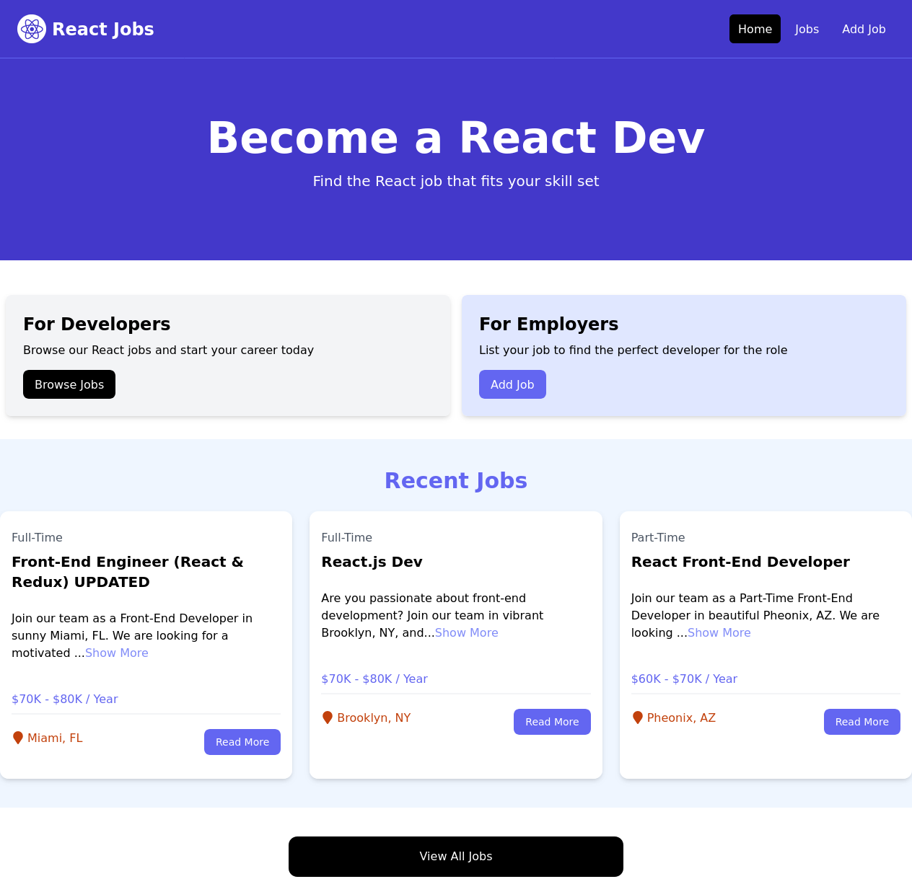
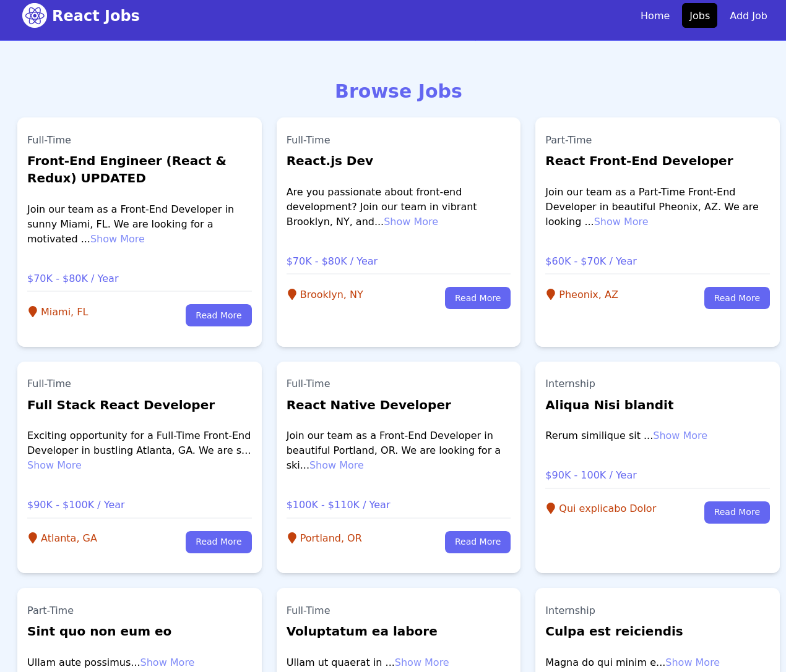
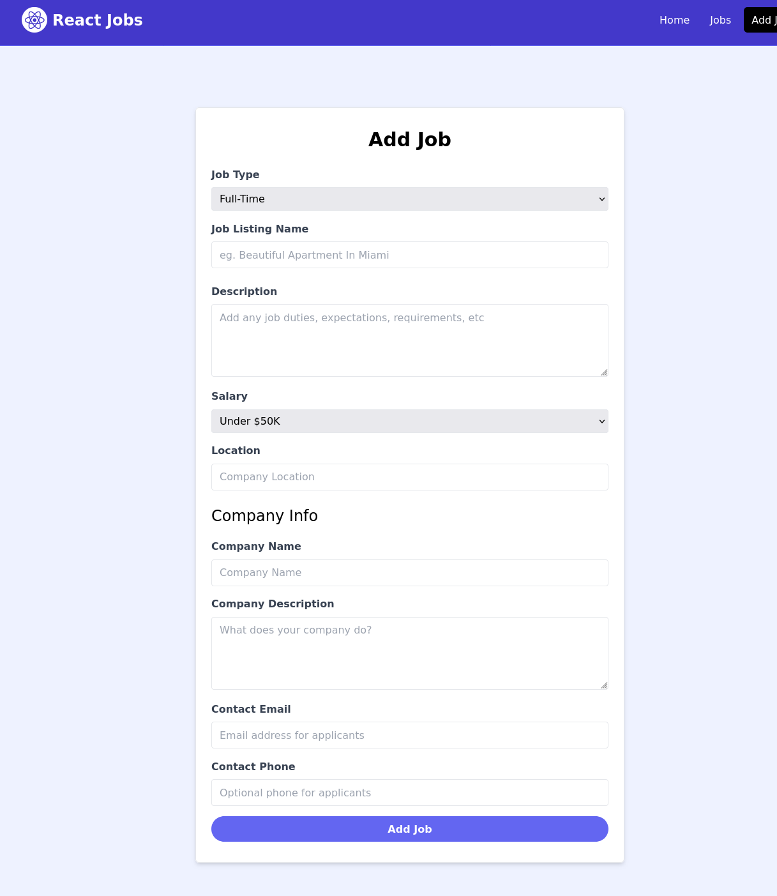
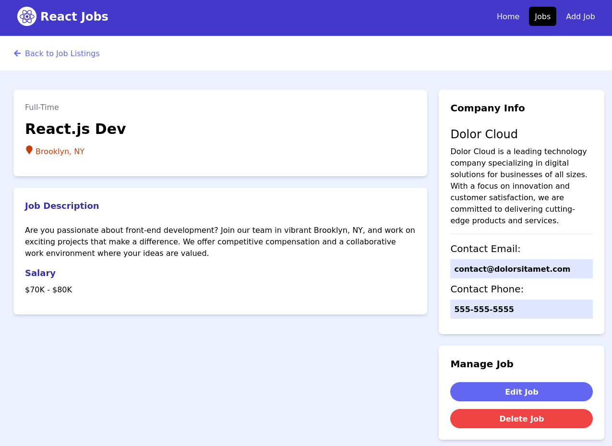
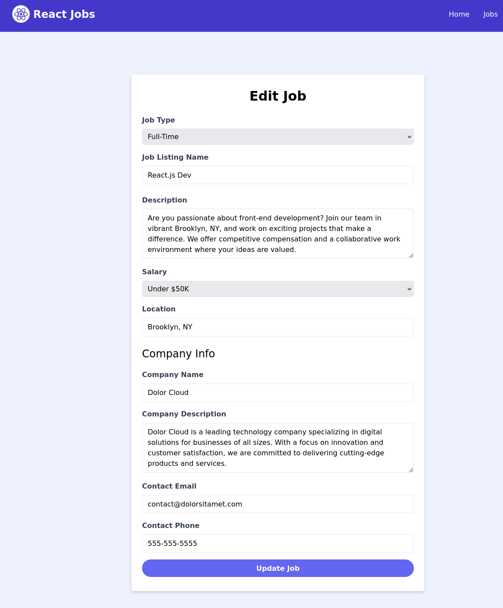

# React Jobs Application

## Overview
React Jobs is a modern web application built with React to help users manage job postings efficiently. The application provides a seamless user experience for viewing, adding, updating, and managing job information. 

---

## Features

- **Home Page:** Overview of the app's purpose and navigation.
- **Jobs Page:** Displays a list of all available jobs.
- **Add Job:** Allows users to create new job postings.
- **Single Job Page:** Provides detailed information about a specific job.
- **Update Job:** Enables users to edit job details.

---

## Installation

1. Clone the repository:
   ```bash
   git clone <repository_url>
   ```

2. Navigate to the project directory:
   ```bash
   cd react-jobs-app
   ```

3. Install dependencies:
   ```bash
   npm install
   ```

4. Start the development server:
   ```bash
   npm start
   ```

---

## Technologies Used

- React.js
- React Router
- CSS/SCSS for styling
- Context API/Redux (optional based on app state management)

---

## Screenshots

### Gallery

Below are screenshots of the application. Click on any image for an expanded view:

|  |  |
|------------------------------------------|-----------------------------------------------|
| Home Page                                 | Jobs Page                                      |

|  |  |
|------------------------------------------|-----------------------------------------------|
| Add Job Page                              | Single Job Page                                |

|  |
|----------------------------------------------------|
| Update Job Page                                     |

---

## How to Use

1. Navigate to the **Jobs** page to view the list of available jobs.
2. Click on a job to view its details on the **Single Job Page**.
3. Use the **Add Job** page to create a new job posting.
4. Edit an existing job by navigating to the **Update Job** page.

---


## License

This project is licensed under the MIT License. See the LICENSE file for more details.

---

## Contact

For any queries or feedback, please contact the developer at [khalidmahmo827@gmail.com].
